# Programmierung und Deskriptive Statistik (WiSe 2022/2023) <!-- omit in toc -->


## Inhaltsverzeichnis <!-- omit in toc -->
- [Allgemeine Informationen](#allgemeine-informationen)
- [Anleitung, wie man beitragen kann](#anleitung-wie-man-beitragen-kann)
  - [Schritt 1: Repository kopieren (***Fork***)](#schritt-1-repository-kopieren-fork)
    - [**Wichtige Eigenschaften eines Forks:**](#wichtige-eigenschaften-eines-forks)
  - [Schritt 2: Fork mit Original-Repo synchronisieren (***Fetch upstream***)](#schritt-2-fork-mit-original-repo-synchronisieren-fetch-upstream)
  - [Schritt 3: Eigenen 'Zweig' erstellen (***Branch***)](#schritt-3-eigenen-zweig-erstellen-branch)
  - [Schritt 4: Änderungen vornehmen und speichern (***Commit changes***)](#schritt-4-änderungen-vornehmen-und-speichern-commit-changes)
  - [Schritt 5: Änderungsvorschläge einreichen (***pull request***)](#schritt-5-änderungsvorschläge-einreichen-pull-request)

## Allgemeine Informationen
Dieses Repository enthält alle Skripte für den Kurs "Programmierung und Deskriptive Statistik" (Modul C1) im Wintersemester 2022/2023 bei Belinda Fleischmann an der OVGU Magdeburg.

Auf unserer Lehrstuhlseite finden Sie den Kurs ["hier"](https://www.ipsy.ovgu.de/Institut/Abteilungen+des+Institutes/Methodenlehre+I+_+Experimentelle+und+Neurowissenschaftliche+Psychologie/Lehre/Wintersemester+2023/Programmierung+und+Deskriptive+Statistik.html). 

## Anleitung, wie man beitragen kann
Im Folgenden finden Sie eine Schritt-für-Schritt Anleitung dafür, wie Sie zu diesem Repository beitragen können (z.B. Typos korrigieren). Das hier beschriebene Vorgehen erfolgt auschließlich online über das github Webinterface. Das heißt, Sie benötigen hierfür keine gesonderte Desktop-App. 

Um Änderungen (z.B. Korrektur von Typos) an einem fremden git repository vorzunehmen, müssen Sie zunächst eine Kopie (auch "**Fork**" gennant) des Original-repository's auf Ihrem eigenen git-account erstellen (siehe [Schritt 1: "forking"](#schritt-1-repository-kopieren-fork)). Ihren Fork halten Sie up-to-date, indem Sie ihn mit dem Original-Repo synchronisieren [Schritt 2: "Fetch upstream")](#schritt-2-fork-mit-original-repo-synchronisieren-fetch-upstream). In Ihrem *fork* können Sie dann eigene "**branches**" [Schritt 3: "branch" erstellen](#schritt-3-eigenen-zweig-erstellen-branch) und in diesem branch Änderungen vornehmen. Diese Änderungen können Sie über "**commits**" in Ihrer eigenen Fork speichern (siehe [Schritt 4: "commit changes"](#schritt-4-änderungen-vornehmen-und-speichern-commit-changes). Anschließend können sie beim Original-repository beantragen, dass Ihre Änderungen übernommen werden, indem Sie sogenannte **"pull requests"** eröffnen [Schritt 5: "pull request"](#schritt-5-änderungsvorschläge-einreichen-pull-request). Wenn Sie einen pull request eröffnen, wird dem Eigentürmer des repository's eine Anfrage mit Ihren Änderungsvorgeschlägen gesendet. Wenn der Eigentümer den pull request annimmt, werden Ihre Änderungsvorschläge eingearbeitet. In git-Sprache, führt der Eigentümer mit der Annahme Ihres pull requests einen **"merge"** Ihres pull requests, und somit Ihrer Änderungen, zum Original-repository durch. 

### Schritt 1: Repository kopieren (***Fork***)
Anmerkung: Ein Fork muss nur einmal erstellt werden. Falls Sie bereits einen Fork erstellt haben, reicht es, diesen zu aktualisieren (siehe [Schritt 2: "Fetch upstream")](#schritt-2-fork-mit-original-repo-synchronisieren-fetch-upstream)) und dann mit Schritten 3-5 fortzufahren.

Auf github können wir eine Kopie eines repository erstellen, indem wir das repository "forken". Dazu öffnen wir im Webbrowser die Hauptseite des repository's (in unserem Fall: https://github.com/dirk-ostwald/allgemeines-lineares-modell-22) und klicken auf den Button `Fork`.

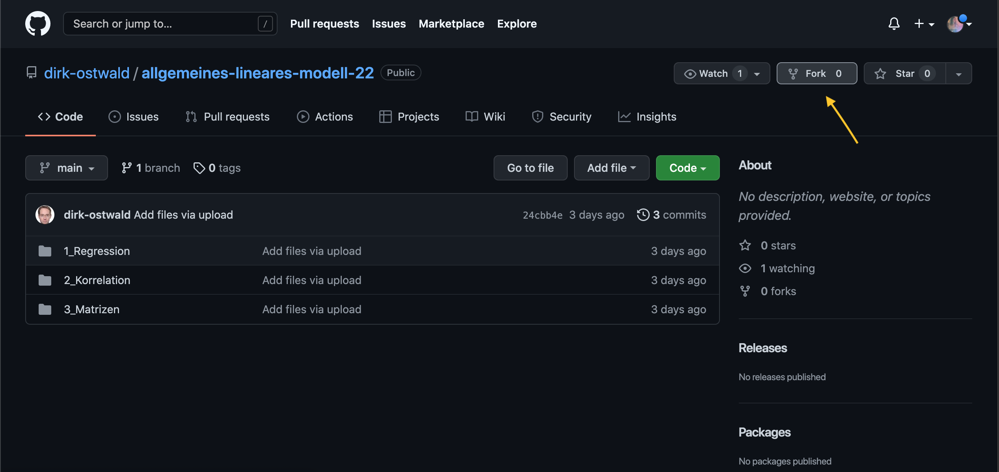

Wir werden dann auf eine neue Seite weitergeleitet, wo wir dem Fork, den wir erstellen möchten einen *Repository name* geben können. Es empfiehlt sich, den Namen des Original-Repository's zu wählen. In diesem Beispiel also "allgemeines-lineares-modell-22". Anschließend klicken wir auf `Create fork`. 

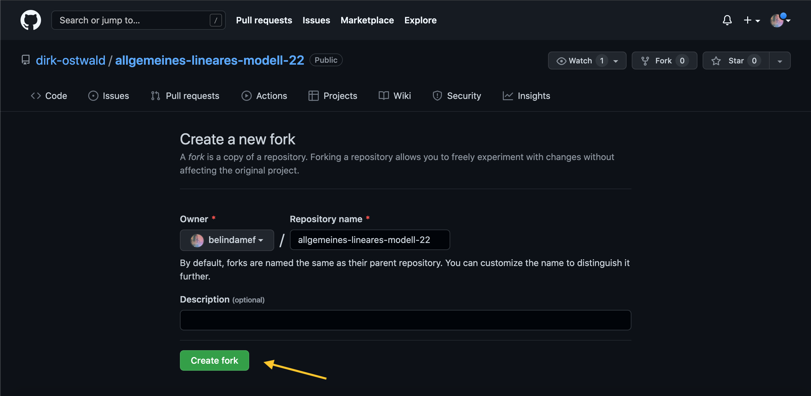

Das Kopieren kann ggf. einen Moment dauern und wir sehen:

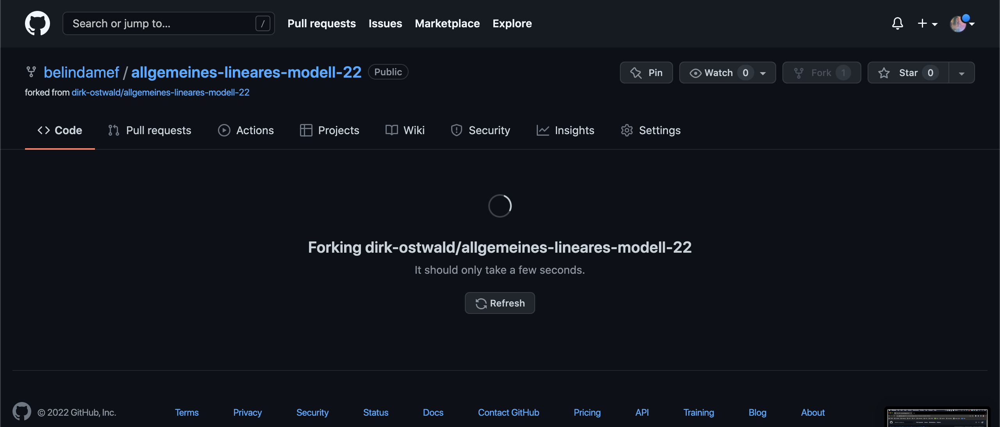

Wenn das Forking erfolgreich abgeschlossen wurde, werden wir automatisch auf die Hauptseite unseres neuen Forks (also der Kopie des Original-Repository's, die unter unserem eigenen github-account erstellt wurde) weitergeleitet. Oben links wird unser git-account-Name und dahinter nach einem ```/``` der Name unsers Forks (rosa Pfeil) angezeigt. Darunter wird uns ein Link zur Original-Repo angezeigt (grüner Pfeil). 

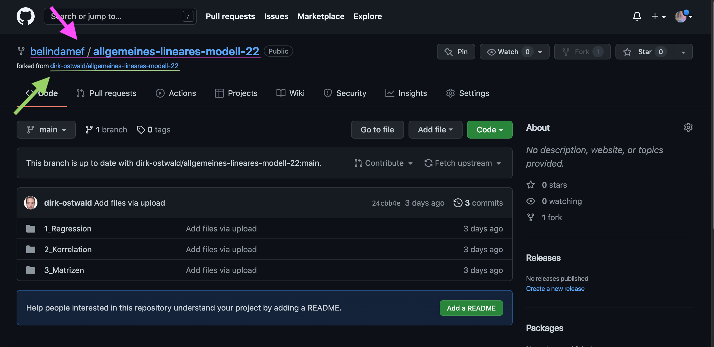

  
#### **Wichtige Eigenschaften eines Forks:** 

* Alle Änderungen, die im Fork vorgenommen werden, werden *nicht* im Original-Repository geändert. Änderungen im eigenen Fork können mit der [**pull-request**](#schritt-5-änderungsvorschläge-einreichen-pull-request)-Funktion als Anfrage beim Eigentümer des Original-Repo's eingereicht werden. Erst wenn der Eigentümer den pull-request annimmt, werden die Änderungen im Original-Repo übernommen. (Achtung! bevor Sie Änderungen vornehmen, sollten Sie stets zuerst Schritt 2 - 4 durchführen)
* Änderungen im Original-Repository werden im Fork *nicht* automatisch synchronisiert. Ein Fork kann jedoch jederzeit mit dem Origianl-Repository synchronisiert werden (mit der [**fetch upstream**](#schritt-2-fork-mit-original-repo-synchronisieren-fetch-upstream)-Funktion)
* Einmal erstellt, bleibt ein Fork solange bestehen, bis wir es löschen. Falls Sie vorhaben, in Zukunft noch weitere Änderungen vorzunehmen, empfiehlt es sich, den Fork zu behalten, und diesen regelmäßig mit dem Original-Repo zu synchronisieren (siehe [**fetch upstream**](#schritt-2-fork-mit-original-repo-synchronisieren-fetch-upstream)) 
* Löschen des Fork führt nicht zum Löschen der Original-Repository. 

### Schritt 2: Fork mit Original-Repo synchronisieren (***Fetch upstream***)
Um den eigenen Fork mit dem Original-Repo zu synchronisieren, gehen wir auf die Hauptseite unsere Fork. Dort wird uns stets angezeigt, ob die branch, die ausgewählt ist *up-to-date* oder ggf. *\<Anzahl\> commits behind* ist. 

Es empfiehlt sich, den eigenen Fork *zuerst* mit dem Original-Repo zu snychronieren, bevor wir Änderungen vornehmen, um Bearbeitungskonflikte zu vermeiden. 

Dazu klicken wir einfach auf ```Sync fork``` und ```Update branch``` (siehe unten).

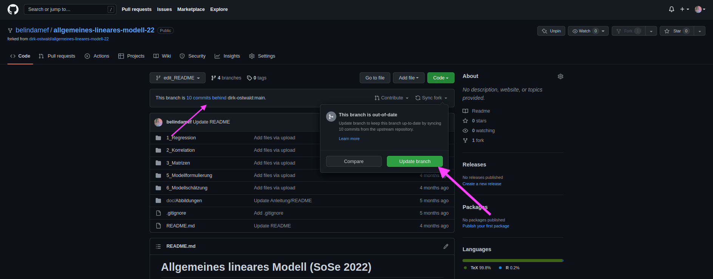

Nach erfolgreicher Synchronisierung erhalten wir die Benachrichtigung *Successfully fetched and fast-forwarded from upstream \<Name des original/upstream Repo\>*.

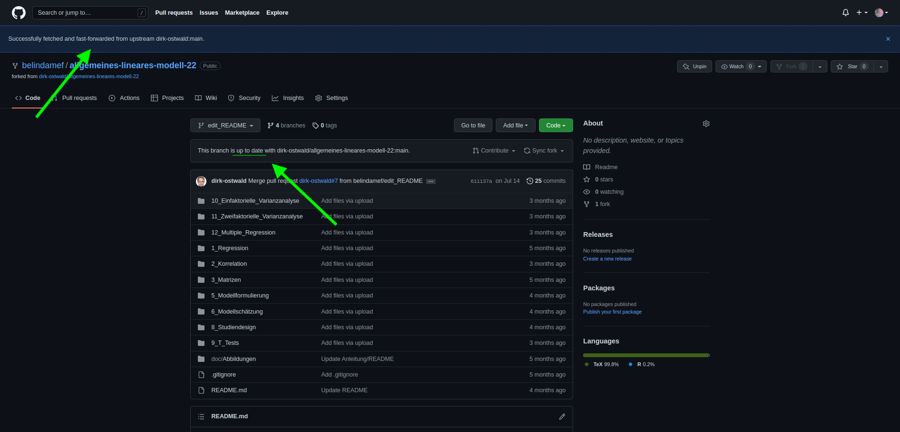`

### Schritt 3: Eigenen 'Zweig' erstellen (***Branch***)
Ein git Repository kann einen oder mehrere sogenannte "Branches" haben. Es gibt immer eine "Haupt-branch", die idR. "main" oder "master" heißt. Änderungen (auch im eigenen Fork) sollten stets auf einer extra dafür kreierten branch erfolgen. 

Um einen branch zu erzeugen klicken wir auf den Reiter, wo man die branch auswählen kann (pinker Pfeil unten im Bild). Dort können wir den Namen einer neuen branch eingeben und diesen erstellen. 

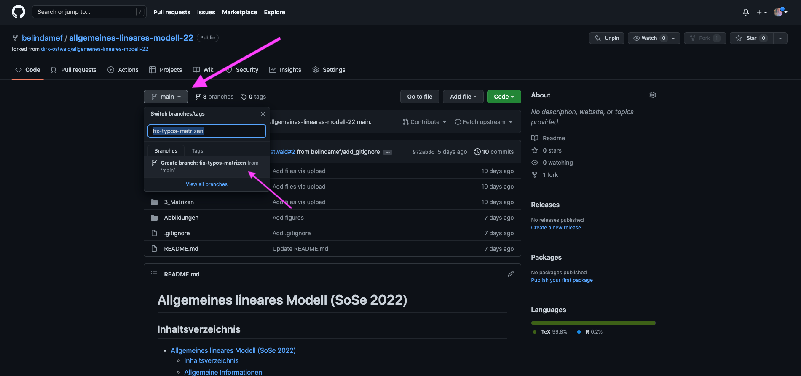

Wenn github die neue branch erstellt hat bekommen wir eine eine Benachrichtigung in der oberen Leiste und befinden uns automatisch auf unserer neuen branch.

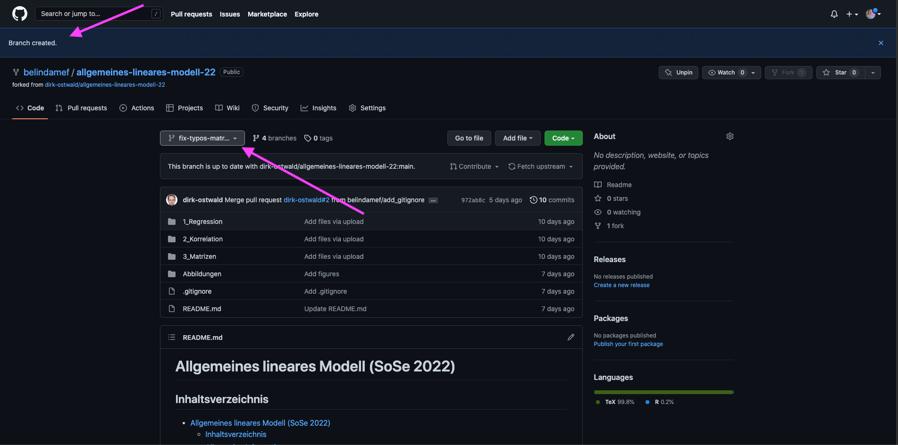

### Schritt 4: Änderungen vornehmen und speichern (***Commit changes***)

Bevor wir Änderungen vornehmen, sollten wir stets sicherstellen, dass 
1. unser Fork up-to-date ist (siehe [***fetch upstream***](#schritt-2-fork-mit-original-repo-synchronisieren-fetch-upstream)) und
2. wir uns in einer anderen branch als der Hauptbranch befinden (siehe [***branch***](#schritt-3-eigenen-zweig-erstellen-branch))

Um online Änderungen vorzunehmen öffnen wir zunächst die Datei, an der wir etwas ändern möchten. Dazu klicken wir einfach auf die entsprechenden Ordner und/oder Dateien. In unserem Beispiel möchten wir einen Typo ("and" statt "an") im R-Markdown Code für das Vorlesungs-Skript 3_Matrizen korrigieren. Wir brauchen also die Datei ```3_Matrizen.Rmd```, welche sich im Ordner ```/3_Matrizen``` befindet. Wenn wir die Datei geöffnet haben, wird uns der code im Lesemodus angezeigt. Das heißt, wir können den code noch nicht bearbeiten. Um die Bearbeitung freizuschalten klicken wir auf das Bearbeitungssymbol (Bleistift) oben rechts 

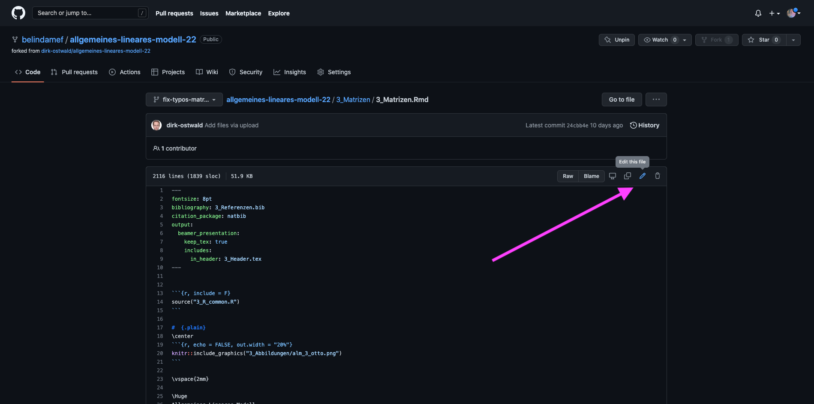

Es stehen nun 2 Reiter zur Auswahl. Im ```Edit file```-Reiter (pinker Pfeil) können wir die gewünschte(n) Änderung(en) (grüner Pfeil) vornehmen.

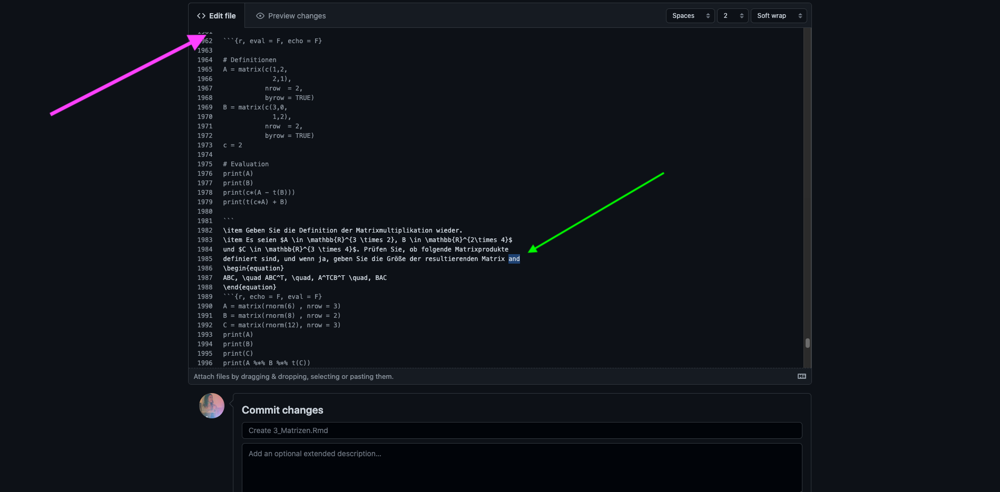

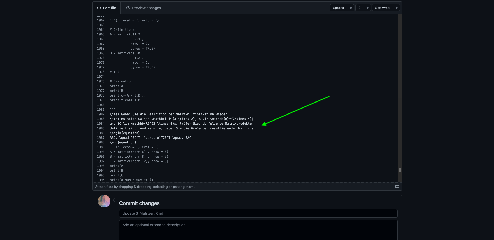

Anschließend können wir unsere Änderung im ```Preview changes```-Reiter (pinker Pfeil) überprüfen (orangener Pfeil) und speichern (in git-Spache: "Änderung übergeben" / ***commit changes***). Jeder commit braucht eine **commit message**, welche aussagt, wie sich diese Änderung auf den Code auswirkt. commit messages (hellblauer Pfeil) werden konventionell im Imperativ geschrieben, weil Sie quasi als Befehl ausdrücken, was ein commit am code ändern soll. In unserem Beispiel korrigiert unser commit einen typo. Anders ausgedrückt, führt dieser commit den Befehl *"Fix typo in Selbskontrollfrage 8"* aus. Optional kann darunter noch eine detailliertere Beschreibung der Änderung angegeben werden. Mit dem button ```Commit changes``` (grüner Pfeil) werden die Änderungen im eigenen branch des eigenen Forks gespeichert.

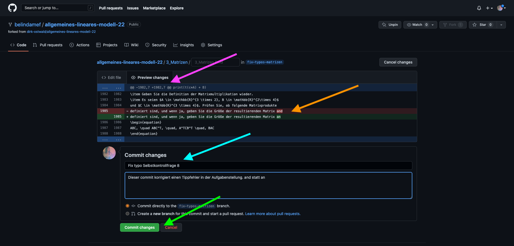

Wenn wir jetzt auf die Hauptseite unseres Forks navigieren, wird uns automatisch angezeigt, dass unsere branch ```fix-typos-matrizen``` "recent pushes" hat und die Option zu ```Compare & pull request``` besteht. Für unsere Zwecke kann "recent pushes" als "neue Änderungen" verstanden. Diese Benachrichtigung sagt uns also, dass auf unserer branch neue Änderungen gemacht wurden und die Option besteht, diese mit dem Original-Repo zu vergleichen (Compare) und ggf. unsere Änderungen als Vorschläge einzureichen ([**pull-request**](#schritt-5-änderungsvorschläge-einreichen-pull-request))

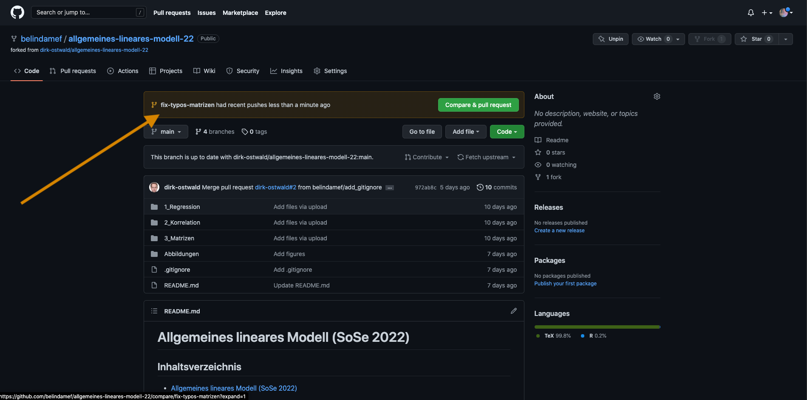


### Schritt 5: Änderungsvorschläge einreichen (***pull request***)

Änderungen, die im eigenen Fork gespeichert (commited) sind können per ***pull request*** als Vorschlag an das Original-Repo eingereicht werden. Dazu eröffnen wir einen **pull request**, indem wir auf den button ```Compare & pull request``` klicken (grüner Pfeil).


Es öffnet sich eine neue Seite, auf der wir einen Titel (pink) und eineBeschreibung (orange) zu unserem pull request angeben können. Falls ein pull request nur einen commit beinhaltet, so wie in unserem Beispiel, wählt github per default die commit message und description des einen commits. Anschließend klicken wir auf ```Create pull request```, um unsere Änderungen einzureichen. 
